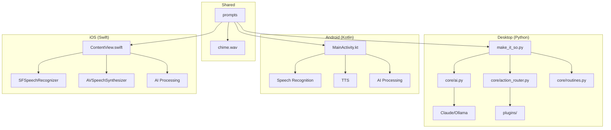
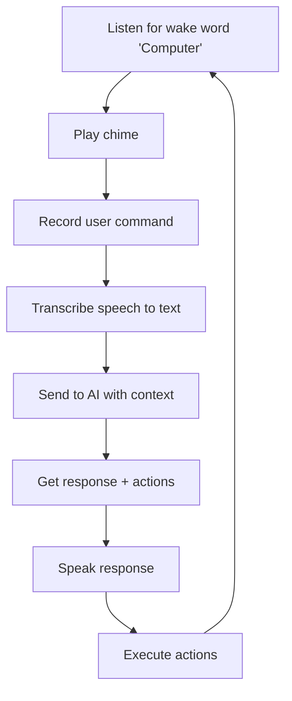
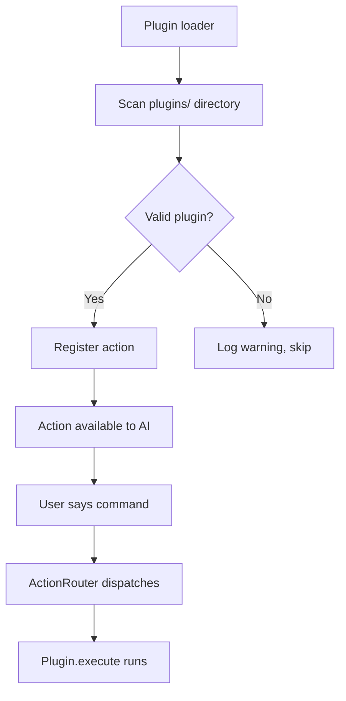
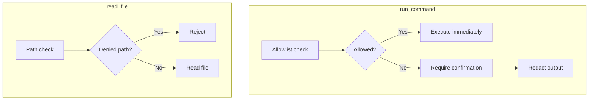

# landonkea-makeItSoNumberOne — Design & Workflow

## High-Level Overview

## Voice Loop (All Platforms)

## Desktop Plugin System

## Security Layers (Desktop)

## File Relationships

| File | Purpose | Platform |
|------|---------|----------|
| `desktop/make_it_so.py` | Main voice loop | Desktop |
| `desktop/core/ai.py` | Claude/Ollama integration | Desktop |
| `desktop/core/action_router.py` | Action dispatch | Desktop |
| `desktop/core/routines.py` | Macro matching | Desktop |
| `desktop/plugins/` | User plugins | Desktop |
| `android/app/.../MainActivity.kt` | Android entry | Android |
| `ios/MakeItSo/ContentView.swift` | iOS entry | iOS |
| `shared/` | Chime + prompts | All |

## draw.io

[Open in draw.io](https://app.diagrams.net/#RVoice%20assistant%20architecture)
